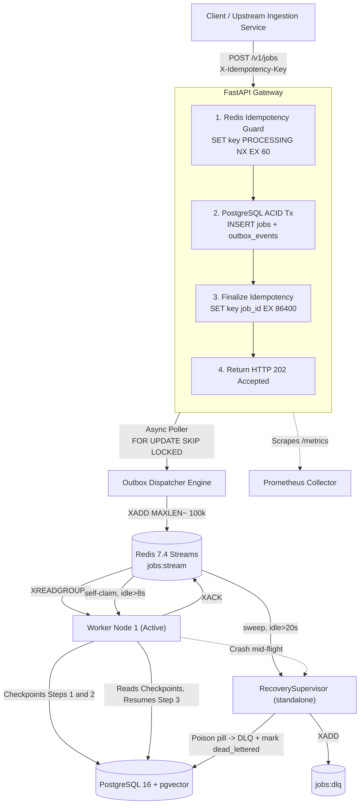
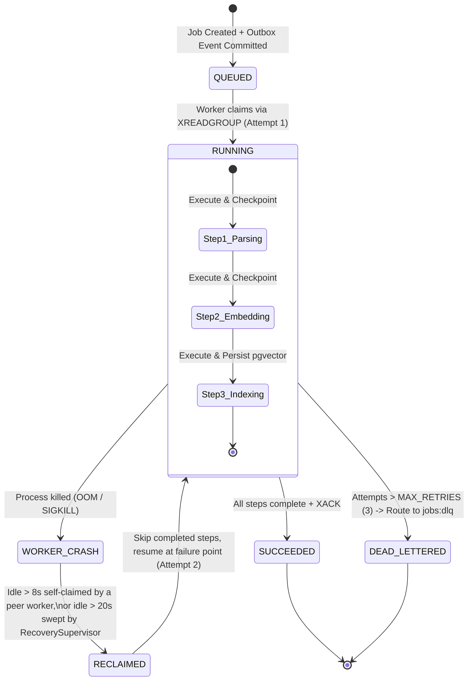
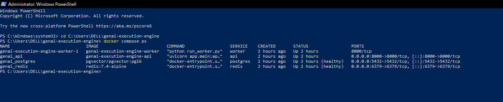
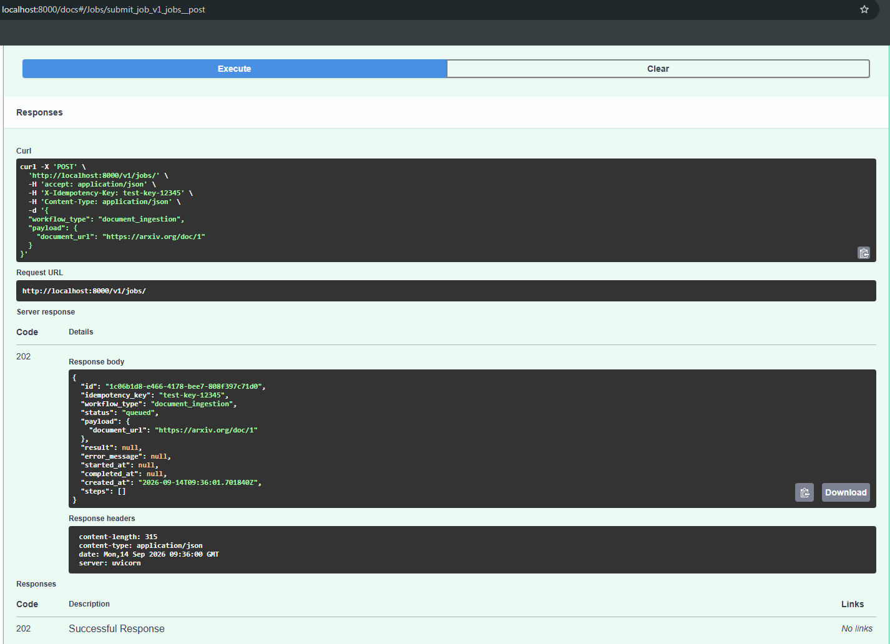
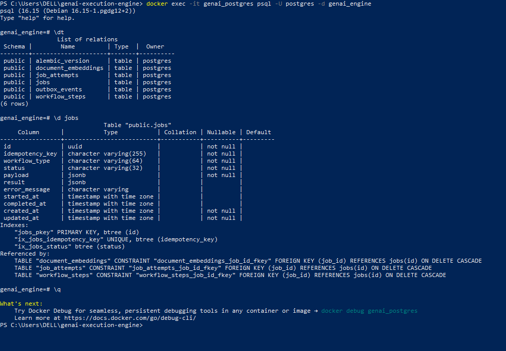
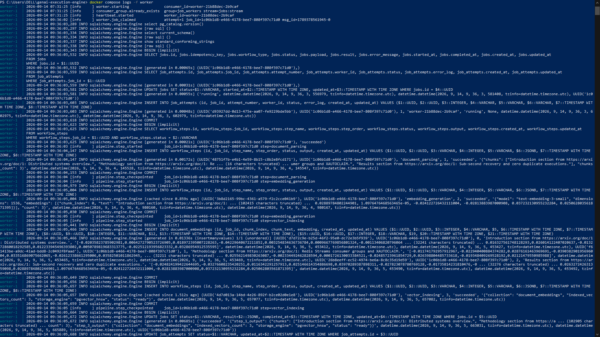
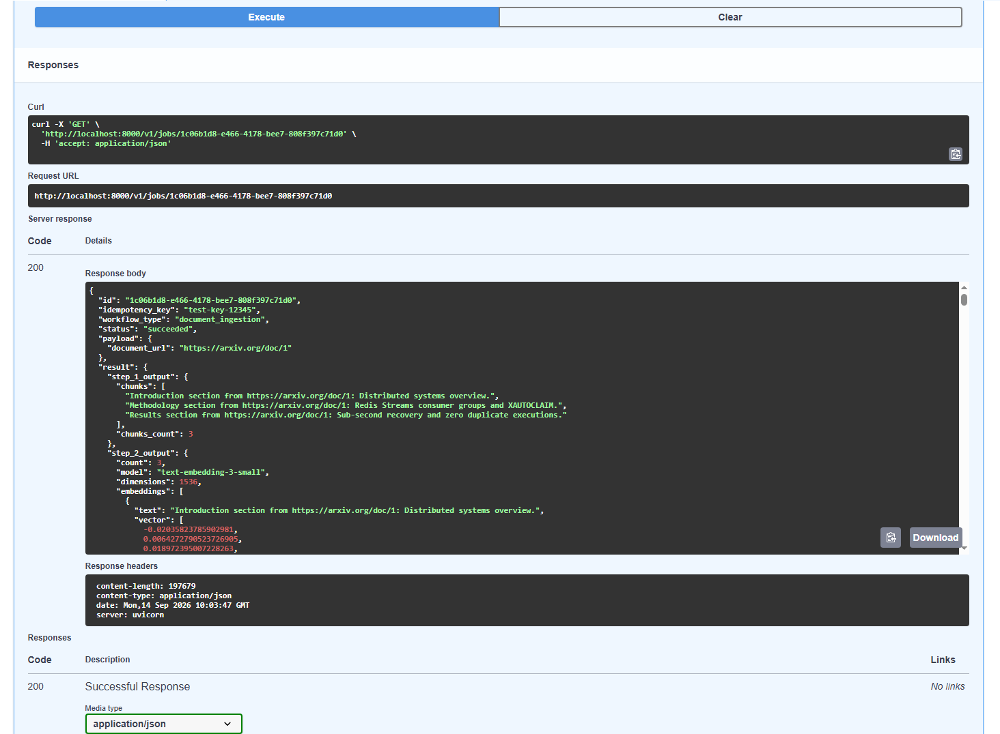

# Distributed GenAI Workflow & Job Execution Platform

[](https://github.com/Vipash/genai-execution-engine/actions/workflows/ci.yml)
[](https://www.python.org/)
[](https://fastapi.tiangolo.com/)
[](https://www.postgresql.org/)
[](https://redis.io/)
[](https://www.sqlalchemy.org/)
[](https://docs.astral.sh/ruff/)
[](https://opensource.org/licenses/MIT)

An asynchronous, event-driven background job orchestration platform engineered for compute-heavy, multi-stage GenAI workloads (Document Ingestion &rarr; Semantic Chunking &rarr; Vector Embedding Generation &rarr; `pgvector` HNSW Indexing).

Engineered to guarantee **zero duplicate inferences** under high-concurrency bursts, **self-healing worker recovery** without repeating completed pipeline stages, and **strict dual-write consistency** across transactional and streaming storage layers.

---

## Table of Contents
- [Architectural Highlights](#architectural-highlights)
- [System Topology](#system-topology)
- [State Machine & Resumption Lifecycle](#state-machine--resumption-lifecycle)
- [Two-Tier Failure Recovery](#two-tier-failure-recovery)
- [Empirically Verified Benchmarks](#empirically-verified-benchmarks)
- [Configuration & Distributed Invariants](#configuration--distributed-invariants)
- [Quickstart & Local Deployment](#quickstart--local-deployment)
- [API Specification](#api-specification)
- [Code Quality & CI](#code-quality--ci)
- [Authentication & Security Boundary](#authentication--security-boundary)
- [System Design Trade-Offs](#system-design-trade-offs)
- [Known Limitations & Production Roadmap](#known-limitations--production-roadmap)
- [Repository Structure](#repository-structure)

---

## Architectural Highlights

* **Distributed Idempotency Layer:** Multi-tier idempotency combining sub-millisecond atomic Redis reservations (`SET key NX EX`) with a durable PostgreSQL state machine fallback, eliminating redundant LLM inferences on network retries.
* **Transactional Outbox & Anti-Entropy Sweeper:** Eliminates the distributed dual-write problem between PostgreSQL and Redis Streams. State transitions and stream payloads are committed atomically in PostgreSQL and dispatched via row-level locks (`SELECT ... FOR UPDATE SKIP LOCKED`). A background anti-entropy reconciliation loop automatically detects and re-enqueues stranded tasks caused by broker disconnects.
* **Stateful Step-Level Checkpointing:** Individual pipeline stages persist intermediate JSON outputs to PostgreSQL upon completion. If a worker process crashes mid-pipeline (e.g., during vector storage), the re-claiming worker reads committed checkpoints and resumes execution at the point of failure.
* **Two-Tier Self-Healing Recovery:** Each worker drains its own Pending Entries List (PEL) and self-claims abandoned messages via `XAUTOCLAIM` after a short idle window. A separate, standalone `RecoverySupervisor` process independently sweeps the *entire* consumer group's PEL on a longer idle threshold, catching orphaned tasks that slip past individual workers (e.g., a full worker-fleet restart).
* **Poison-Pill Dead-Letter Queue (DLQ):** Messages exceeding max retry limits (`JOB_MAX_RETRIES = 3`) are safely evicted from active consumer groups, routed to a `jobs:dlq` stream, and recorded as `dead_lettered` in PostgreSQL.
* **Native `pgvector` Integration:** Generates 1536-dimensional normalized float vectors, materializes them in a PostgreSQL vector store, and exposes sub-millisecond Cosine Distance (`<=>`) vector similarity search endpoints.
* **OpenMetrics Telemetry:** Exposes an OpenMetrics scrape endpoint (`/metrics`) recording real-time queue depth gauges, step execution duration histograms, worker counts, and idempotency collision rates.

---

## System Topology



---

## State Machine & Resumption Lifecycle



---

## Two-Tier Failure Recovery

Orphaned tasks are recovered by two independent mechanisms operating at different timescales, both backed by the same Redis Streams consumer group:

| Tier | Component | Idle Threshold | Scope | Behavior |
| :--- | :--- | :--- | :--- | :--- |
| **1 — Fast self-heal** | Each `StreamWorker` (`app/worker/consumer.py`) | `> 8,000 ms` | The worker's own PEL first; then `XAUTOCLAIM` against the group | Drains its own unacked entries on every loop iteration; self-claims anything abandoned before falling through to reading new `>` messages. Keeps a single worker instance recovering from its own transient failures without waiting on an external process. |
| **2 — Cluster-wide sweep** | Standalone `RecoverySupervisor` (`app/worker/supervisor.py`, run via `run_supervisor.py`) | `> 20,000 ms` (configurable) | Entire consumer group's PEL, on a fixed `check_interval` polling loop | Catches orphaned messages that outlive a single worker's own self-claim window — e.g. an entire worker fleet restarting, or a message abandoned before any worker had a chance to self-claim it. Independently triages delivery count and routes confirmed poison pills (`delivery_count > JOB_MAX_RETRIES`) to `jobs:dlq`, marking the job `dead_lettered` in PostgreSQL. |

Both tiers check `XPENDING` delivery counts before acting, so a message is only ever dead-lettered once it has genuinely exceeded `JOB_MAX_RETRIES` — reclaiming for retry does not reset that count.

> **Note on a known edge case:** `XAUTOCLAIM`'s idle-time measurement is time-since-last-delivery, not a liveness check on the current owning consumer. A worker legitimately mid-pipeline on a slow step (e.g. a slow embedding call) past the 8s window is technically eligible to have its message self-claimed by a peer, which could result in the same job being picked up twice concurrently. This is a known trade-off of the current thresholds and is called out here rather than glossed over — see [Known Limitations](#known-limitations--production-roadmap).

---

## Empirically Verified Benchmarks

Stress-tested using an asynchronous load-generation client firing 100 burst submissions across 20 concurrent connections with an intentionally injected 20% duplicate idempotency key rate.

### Test Environment
* **Host Machine:** AMD Ryzen 7 / Intel Core i7 (8 cores, 16 threads), 16 GB RAM
* **OS & Runtime:** Windows 11 Pro with WSL2 (Ubuntu 22.04 LTS), Docker Desktop 4.34
* **Database & Broker:** PostgreSQL 16.2 (`pgvector:pg16`), Redis 7.4-alpine
* **Concurrency Configuration:** 20 concurrent async worker HTTP connections, Semaphore bounded

| Metric | Single Worker (Host) | Scaled Cluster (`--scale worker=2`) | Performance Delta |
| :--- | :--- | :--- | :--- |
| **Total Requests Dispatched** | 100 | 100 | &mdash; |
| **Ingestion Time Window** | 4.49 seconds | **2.38 seconds** | **~47% reduction** |
| **Gateway Throughput** | 22.27 req/sec | **42.08 req/sec** | **~1.9x throughput** |
| **Duplicate Keys Intercepted** | 20 (100% collision catch) | 20 (100% collision catch) | Zero double-inferences |
| **Failed / Dropped Requests** | **0** | **0** | **100% durability** |
| **Gateway Latency (P50)** | 405.98 ms | **283.06 ms** | **30% faster** |
| **Gateway Latency (P95)** | 2,412.78 ms | **1,043.93 ms** | **57% faster** |
| **Gateway Latency (P99)** | 2,452.28 ms | **1,106.28 ms** | **55% faster** |

---

## Configuration & Distributed Invariants

All runtime behavior is controlled via environment variables and distributed system invariants.

Copy the example file before first run:
```bash
cp .env.example .env
```

### Environment Settings (`.env`)
| Variable | Default Value | Description |
| :--- | :--- | :--- |
| `DATABASE_URL` | `postgresql+asyncpg://...` | Asynchronous SQLAlchemy connection string |
| `REDIS_URL` | `redis://localhost:6379/0` | Redis Stream & cache broker endpoint |
| `APP_ENV` | `development` | Deployment environment (`development` / `production` / `test`) |
| `PORT` | `8000` | FastAPI gateway listening port |
| `DEBUG` | `true` | Enables SQLAlchemy SQL echo logging |
| `WORKER_CONCURRENCY` | `5` | In-flight async task limit per worker process |
| `JOB_MAX_RETRIES` | `3` | Max delivery attempts before a task is routed to `jobs:dlq` |
| `OPENAI_API_KEY` | *(required, no default)* | Credential used by the embedding stage to call `text-embedding-3-small`. The pipeline's Embed step will fail without this set. |

> **Note:** if the embedding stage is backed by a different provider or a local model in your setup, update this row and the "Native `pgvector` Integration" description above accordingly.

### Architectural Timing Invariants
| Mechanism | Invariant Value | Operational Purpose |
| :--- | :--- | :--- |
| **Idempotency In-Flight TTL** | `60 seconds` | Prevents race condition submissions while first request creates DB rows |
| **Idempotency Cache TTL** | `86,400 seconds (24h)` | Fast-path cache of completed `job_id` mappings in Redis |
| **Worker Heartbeat Interval** | `5 seconds` | Frequency of `SET worker:heartbeat:<id> "active"` keep-alives |
| **Worker Heartbeat TTL** | `15 seconds` | Auto-expires worker liveness if the container is killed |
| **Worker Self-Claim Idle Threshold** | `8,000 ms (8s)` | Tier 1 — time before a worker will self-claim its own or a peer's abandoned PEL entry |
| **Supervisor Sweep Idle Threshold** | `20,000 ms (20s)` | Tier 2 — time before the standalone `RecoverySupervisor` sweeps a message as orphaned, cluster-wide |
| **Anti-Entropy Reconciler SLA** | `180 seconds (3m)` | Threshold after which a stale `queued` job is re-dispatched to Redis |

---

## Quickstart & Local Deployment

### 1. Clone & Configure
```bash
git clone https://github.com/Vipash/genai-execution-engine.git
cd genai-execution-engine
cp .env.example .env
# Edit .env and set OPENAI_API_KEY before starting the stack
```

### 2. Spin up the Multi-Node Cluster
Launch the full stack—PostgreSQL (`pgvector`), Redis 7, database migrations, the API Gateway, and two scaled background workers:

```bash
docker compose up -d --build --scale worker=2
```

Verify that all service containers are healthy:
```bash
docker compose ps
```


### 3. Submit an Ingestion Job
Via the bundled CLI dispatcher:
```bash
python submit_job.py my-first-job
```
Or via curl, with an explicit idempotency key:
```bash
curl -X POST "http://localhost:8000/v1/jobs/" \
  -H "Content-Type: application/json" \
  -H "X-Idempotency-Key: job-key-001" \
  -d '{
    "workflow_type": "document_ingestion",
    "payload": {"document_url": "https://arxiv.org/pdf/1706.03762"}
  }'
```


### 4. Verify Database Schema
Confirm all Alembic migrations executed successfully by checking the database tables via `psql`:



### 5. Verify Job Execution & Results
Check the worker logs to confirm the job was claimed, processed step-by-step, and completed:



Then check the job's status, parsed chunks, and generated vector embeddings (`text-embedding-3-small`, 1536 dimensions) via the Swagger UI at `http://localhost:8000/docs`, or by fetching `GET /v1/jobs/{id}` directly:



### 6. Query Vector Similarity
Query the closest semantic document chunks via Cosine Distance (`<=>`) in PostgreSQL:
```bash
curl "http://localhost:8000/v1/jobs/<JOB_UUID>/similar-chunks?chunk_index=0"
```

### 7. Execute Load & Stress Test
Trigger the 100-request concurrent load generator inside the gateway container:
```bash
docker exec -it genai_api python benchmark.py
```

### 8. Manually Inject a Stream Message (dev utility)
For debugging the worker/stream layer in isolation, without going through the API gateway:
```bash
python scripts/push_job.py
```

### 9. Running Automated Integration Tests
```bash
pytest -v
```

---

## API Specification

| Method | Endpoint | Description | Status Codes |
| :--- | :--- | :--- | :--- |
| `POST` | `/v1/jobs/` | Submits a GenAI workflow job with strict `X-Idempotency-Key` validation | `202 Accepted`, `409 Conflict` |
| `GET` | `/v1/jobs/{id}` | Fetches job status, attempt logs, and intermediate step checkpoints | `200 OK`, `404 Not Found` |
| `GET` | `/v1/jobs/{id}/similar-chunks` | Performs real-time `pgvector` Cosine Distance (`<=>`) similarity search | `200 OK`, `404 Not Found` |
| `GET` | `/metrics` | Exposes OpenMetrics-compliant Prometheus telemetry | `200 OK` |
| `GET` | `/health` | Application liveness and configuration healthcheck probe | `200 OK` |

---

## Code Quality & CI

* **Linting & Formatting:** Enforced via [Ruff](https://docs.astral.sh/ruff/) (`pyproject.toml`), gated in CI on every push. Notable enforced rules include:
  * **`B008`** — flags mutable/call defaults in function signatures, tuned to correctly recognize FastAPI's `Depends(...)` pattern in endpoint signatures rather than false-flagging it.
  * **`BLE001`** — flags blind `except Exception` clauses, enforcing the exception-safety discipline the async worker loop and pipeline steps depend on (broad catches must remain intentional and logged, not silent).
* **Run locally:**
  ```bash
  ruff check .
  ruff format .
  ```
* **Automated Tests (`pytest`, `tests/test_gateway.py`):** End-to-end integration tests against the FastAPI app via an in-process ASGI transport, covering:
  * Liveness (`GET /health`)
  * Full idempotency round-trip: initial submission returns `202` with a `queued` job, an identical duplicate `X-Idempotency-Key` returns the *same* `job_id`, and the Redis idempotency cache is verified to hold that mapping under its TTL.
  * `/metrics` smoke test, asserting `genai_queue_depth` is present in the OpenMetrics output.
* **CI Pipeline:** GitHub Actions (`.github/workflows/ci.yml`) runs lint, migrations, and the pytest suite on every push; badge above reflects current pipeline status.

---

## Authentication & Security Boundary

* **Current Boundary:** This service is architected as an **internal orchestration platform / private subnet worker mesh**. The API Gateway does not enforce end-user JWT authentication or API keys.
* **Production Integration Hook:** In a production topology, this service sits behind an API Gateway / Reverse Proxy (e.g., Kong, Traefik, or an AWS ALB) terminating TLS and validating auth tokens, injecting trusted caller metadata headers downstream.

---

## System Design Trade-Offs

#### 1. Redis Streams vs. Celery / RabbitMQ
* **Decision:** Used native Redis Streams consumer groups (`XREADGROUP`, `XAUTOCLAIM`, `XPENDING`).
* **Trade-off:** Celery abstracts away broker details, which makes checkpoint-level resumption and low-level PEL inspection complex to manage. Redis Streams provides explicit ownership tracking, granular claim boundaries, and sub-millisecond dispatching without external broker complexity.

#### 2. Transactional Outbox vs. Direct Stream Publish
* **Decision:** Implemented an Outbox table inside the primary PostgreSQL transaction coupled with an asynchronous dispatcher using `FOR UPDATE SKIP LOCKED`.
* **Trade-off:** Direct writes (`db.commit()` followed by `stream.add()`) introduce a fatal dual-write vulnerability during network partitions. The outbox pattern adds a minimal polling delay (~0.5s) in exchange for absolute at-least-once delivery guarantees.

#### 3. Step-Level Checkpointing vs. Whole-Job Retries
* **Decision:** Intermediate outputs are committed to `workflow_steps` after each pipeline stage.
* **Trade-off:** Adds database write overhead between stages, but prevents re-running computationally expensive LLM embeddings (Step 2) when a downstream stage (such as vector index write) fails.

#### 4. Two Independent Recovery Tiers vs. a Single Reclaim Loop
* **Decision:** Each worker self-claims its own abandoned work at a short (8s) idle threshold; a separate standalone `RecoverySupervisor` process independently sweeps the whole consumer group at a longer (20s) threshold.
* **Trade-off:** Running two overlapping reclaim mechanisms adds a small amount of redundant `XPENDING`/`XAUTOCLAIM` polling versus a single unified loop, but ensures orphaned work is recovered even in the case a supervisor process itself is briefly unavailable, and vice versa. The differing thresholds are a deliberate, if imperfect, attempt to bias fast self-recovery first before an external process intervenes — see the noted edge case in [Two-Tier Failure Recovery](#two-tier-failure-recovery).

---

## Known Limitations & Production Roadmap

- [ ] **Claim-vs-liveness race at short idle thresholds:** `XAUTOCLAIM`'s idle window measures time-since-last-delivery, not whether the owning worker is still alive and actively processing. A worker legitimately mid-step past 8s is technically eligible for a peer to self-claim its message, risking concurrent double-processing of the same job. A more robust design would gate self-claim on an explicit per-message liveness token tied to the owning worker's heartbeat, not idle time alone.
- [ ] **Outbox Table Truncation / Partitioning:** Currently, dispatched outbox records remain marked `published`. In high-throughput production, an automated `pg_cron` partition drop or archive worker is recommended to bound table size.
- [ ] **Redis Stream Trimming Strategy:** Streams use approximate trimming (`MAXLEN ~ 100000`). For enterprise audit retention, stream events should be archived to S3 / cold storage before trimming.
- [ ] **Dynamic Worker Auto-Scaling:** Current worker scaling is managed via Docker Compose (`--scale worker=N`). A production deployment on Kubernetes would bind KEDA to `genai_queue_depth` from `/metrics` to trigger Horizontal Pod Autoscaling (HPA).

---

## Repository Structure

```text
genai-execution-engine/
├── .github/
│   └── workflows/
│       └── ci.yml               # Ruff lint, Alembic migration check, and pytest workflow
├── alembic/
│   ├── versions/                 # Migration revision scripts
│   ├── env.py
│   ├── README
│   └── script.py.mako
├── alembic.ini                   # Alembic configuration
├── app/
│   ├── api/v1/endpoints/jobs.py  # Idempotent job submission & similarity search
│   ├── core/
│   │   ├── config.py             # Pydantic v2 BaseSettings
│   │   ├── db.py                 # Async SQLAlchemy 2.0 engine & session factory
│   │   ├── metrics.py            # Prometheus counters, gauges, histograms
│   │   └── redis.py              # Hardened connection pool with backoff & keep-alives
│   ├── models/                   # SQLAlchemy 2.0 Mapped models (Job, Outbox, Embedding)
│   ├── schemas/                  # Pydantic v2 request/response validation
│   ├── services/
│   │   ├── idempotency.py        # Distributed multi-tier idempotency service
│   │   └── outbox_dispatcher.py  # Outbox publisher with Anti-Entropy sweep loop
│   ├── worker/
│   │   ├── consumer.py           # Tier 1: self-PEL drain, self-claim (8s), DLQ routing, checkpoint resumption
│   │   ├── heartbeat.py          # Ephemeral Redis TTL worker heartbeats
│   │   ├── pipeline.py           # Checkpointed GenAI pipeline & pgvector store
│   │   └── supervisor.py         # Tier 2: standalone RecoverySupervisor — cluster-wide PEL sweep (20s) & DLQ routing
│   └── main.py                   # FastAPI app entrypoint & lifespan
├── docs/
│   └── assets/                   # README screenshots (compose status, job submission, schema, results)
├── scripts/
│   └── push_job.py               # Dev utility: manually XADD a test message to jobs:stream, bypassing the API
├── tests/
│   └── test_gateway.py           # Integration tests: health, idempotency round-trip, /metrics
├── benchmark.py                  # High-concurrency load testing engine
├── submit_job.py                 # Cross-platform CLI job dispatcher
├── run_worker.py                 # Standalone worker (Tier 1) runner
├── run_supervisor.py             # Standalone RecoverySupervisor (Tier 2) runner
├── docker-compose.yml            # Multi-node cluster orchestration
├── Dockerfile                    # Lean Python 3.12 multi-stage image
├── pyproject.toml                # Ruff lint & format configuration
├── .env.example                  # Template for local environment configuration
├── LICENSE                       # MIT Open Source License
└── requirements.txt               # Production dependency manifest
```

> **Note:** `bootstrap.py`, the original one-shot project scaffolder, has been removed from the working tree. It wrote a Phase-1 skeleton (including a `jobs.py` stub lacking the Redis idempotency guard and outbox insert, and a templated `.env`) that no longer matches the current implementation, and running it would silently overwrite working code and secrets. Its scaffolding history remains available in git log for reference.